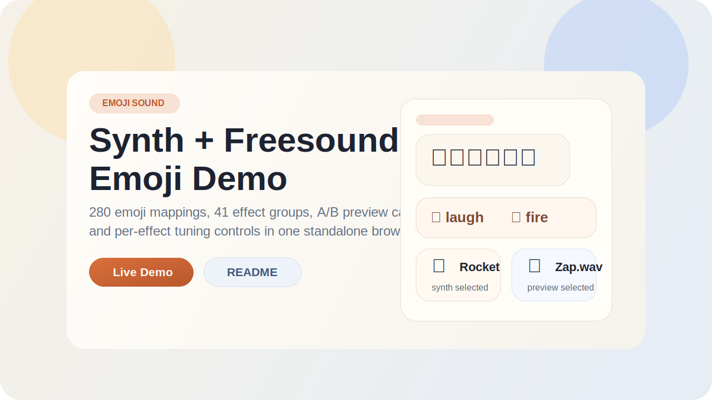

# Emoji Sound

[English](./README.md) | [한국어](./README.ko.md)

브라우저에서 바로 들어볼 수 있는 독립형 이모지 사운드 매핑 프로젝트입니다.

## 데모 열기
- 라이브 데모: [https://hyeminlee.github.io/emoji-sound/](https://hyeminlee.github.io/emoji-sound/)
- 로컬 실행: `demo.html` 열기

## GitHub Pages
- 현재 루트 정적 파일 기준으로 배포되도록 준비되어 있습니다.
- 기본 진입점은 `index.html`이고 실제 데모는 `demo.html`로 연결됩니다.
- `.nojekyll`이 포함되어 있어서 Jekyll 빌드 없이 그대로 서빙할 수 있습니다.

## 이 저장소에 들어 있는 것
- `emoji-sound-map.js`: 이모지 → 효과 매핑과 synth 정의
- `freesound-catalog.js`: paired Freesound preview와 현재 선택 상태
- `demo.html`: synth / Freesound / 추가 후보 비교가 가능한 메인 데모
- `demo.js`: 데모 재생 로직과 effect별 튜닝 슬라이더
- `assets/`: 최종 샘플과 Freesound preview 자산
- `sound-source-manifest.json`: 오디오 출처 추적 파일
- `freesound-shortlist.md`: Freesound CC0 후보 큐레이션 문서

## 작업 원칙
- 사운드 맵이 바뀌면 데모도 같은 변경에 포함합니다.
- `emoji-sound-map.js`를 바꿨다면 `demo.html`과 `demo.js`도 같이 확인합니다.
- synth/preview pairing이 바뀌면 `freesound-catalog.js`, `demo.html`, `demo.js`를 같이 업데이트합니다.
- Freesound 후보가 바뀌면 `demo.html`, `demo.js`, `sound-source-manifest.json`을 같이 업데이트합니다.
- `assets/`에 오디오 파일을 추가하면 같은 변경에서 `sound-source-manifest.json`도 갱신합니다.

## 참고
- `emoji-sound-map.js`는 `EMOJI_SOUND_PROJECT_MAP`과 `TWEETZ_EMOJI_SOUND_MAP` 두 global을 모두 export해서 하위 호환을 유지합니다.
- `assets/fs-clap.wav` 같은 파일이 있으면 synth fallback 대신 샘플을 사용할 수 있습니다.
- 현재 외부 사운드 정책은 Freesound 우선, 그리고 `CC0`만 shipped asset 대상으로 삼는 것입니다.
